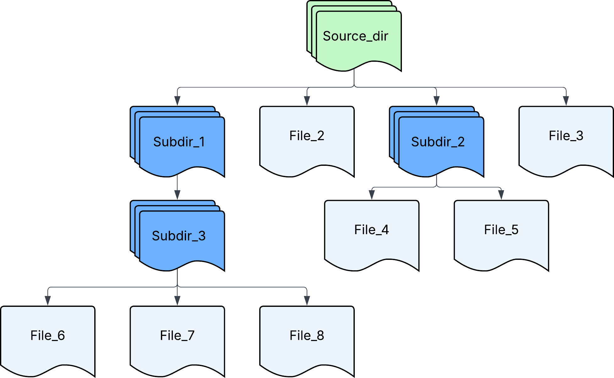
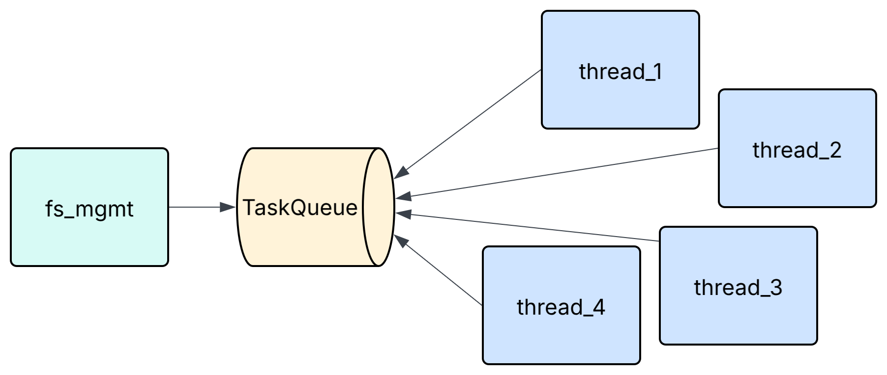

# Proyecto #1 de Principios de Sistemas Operativos

## Introducción

## Descripción del problema

El objetivo de este proyecto es comparar el rendimiento de realizar una tarea colaborativa utilizando múltiples hilos. Para ello se desarrolló una
versión multihilos del programa copy que permite copiar el contenido de un
directorio completo.

Se realizaron múltiples pruebas para determinar la cantidad óptima de hilos para ejecutar este tipo de tarea sobre un único directorio muy
grande.

## Definición de estructuras de datos

- Task: Es una estructura que almacena la ubicación del source del archivo, además de su fuente.
- TaskQueue: Representa la cola compartida de tareas listas para ser trabajadas. Guarda un Task por cada archivo en el directorio source, y usa semáforos para el acceso a la misma.
- CompletedTask: Es una estructura que guarda los resultados de una copia realizada: El subhilo encargado, la duración, y el nombre del archivo.

## Descripción detallada y explicación de los componentes principales

### Modulo principal

Es el encargado de orquestrar la entrada, la creación de hilos, y el proceso de logging. Primeramente se encarga de validar que se ingresen solo dos parámetros, y luego revisa que sean rutas validas para Linux.

Posteriormente le pasa la tarea al modulo de thread pool para que realize su tarea, y luego al de manejo de directorios para que revise el directorio fuente. 

Finalmente dichos módulos terminan su ejecución le pasa los resultados de cada subhilo al módulo de logging para hacer un reporte en CSV de los resultados obtenidos. 

### Modulo de manejo de directorios

Tiene dos funciones principales:

- Revisar que las rutas solicitadas al invocar el comando sean validas en Linux. 
- Recorrer todo el directorio fuente por medio de Bread First Search, para así garantizar un trayecto ordenado.

- Crear una cola de tareas (TaskQueue), la cuál será accesada por el Thread Pool y cada subhilo desocupado tiene la posibilidad de procesar una tarea en ella.
